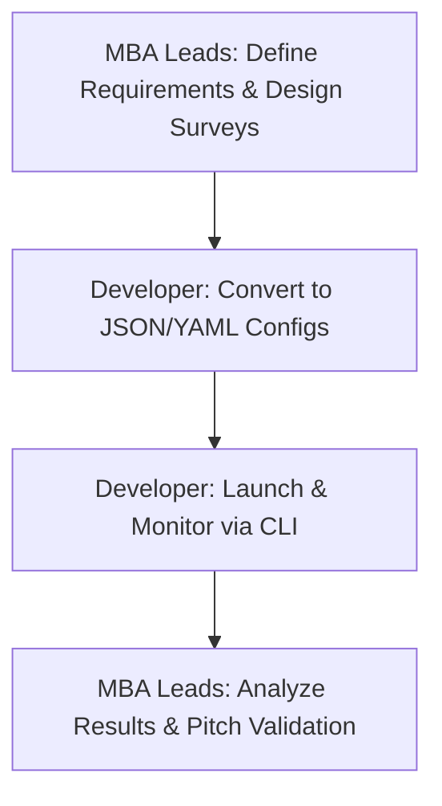

# Global Context Hackathon: Prolific CLI Strategy Plan

This document outlines how a hackathon team (consisting of **MBA/Business Leads** and **Developers**) can leverage the Prolific CLI to rapidly recruit human participants globally, validate business ideas, and conduct real-time user testing.

---

## 💡 Executive Summary for MBA Peers

### What is Prolific?
Prolific is a platform that connects researchers with a pool of **150,000+ vetted human participants** globally. Instead of spending weeks searching for target users or paying expensive agency fees, you can get high-quality feedback from custom-targeted demographics (by country, industry, age, etc.) within minutes.

### Why use the Prolific CLI instead of the website?
For a fast-paced **48-hour hackathon**, speed and repeatability are critical. The Command Line Interface (CLI) allows your developer to:
1. **Automate Parallel Launching:** Launch 5 identical studies targeting 5 different countries simultaneously using simple configuration files.
2. **Speed & Consistency:** Avoid clicking through web UI forms. Make changes in code and re-run instantly.
3. **Real-time Monitoring:** Fetch submissions and download user feedback directly to your team's analytics dashboards or Excel sheets.

---

## 👥 Team Roles & Workflow

To work effectively, divide the responsibilities between the business leads and the developer:



| Role | Responsibility | Tools |
| :--- | :--- | :--- |
| **MBA Leads (Non-Coders)** | <ul><li>Define target demographics (e.g. 30 respondents in Germany, 30 in Japan)</li><li>Create the external survey/prototype (e.g., Google Forms, Qualtrics, Typeform, or Figma)</li><li>Define completion criteria and write study copy.</li></ul> | Typeform, Qualtrics, Google Forms, Figma |
| **Developer (Coder)** | <ul><li>Configure the Prolific CLI and setup credentials</li><li>Translate MBA criteria into YAML/JSON configuration files</li><li>Use the CLI to create, publish, and monitor the studies</li><li>Export submission data to CSV for the team</li></ul> | Go CLI, Terminal, Git |

---

## 🚀 Use Cases for a "Global Context" Hackathon

### 1. Multi-Country Market Validation (A/B Testing Demographics)
* **Goal:** Test whether a business idea resonates more in the United States, India, or Germany.
* **How:** Create three identical studies in the CLI, each applying a country filter, pointing to the same survey link. Compare response sentiment.

### 2. Live Usability & Figma Testing
* **Goal:** Have real users navigate a Figma prototype and provide feedback on layout or accessibility.
* **How:** Set the `external_study_url` in the CLI config to your Figma prototype. Instruct participants to run through a task and input a completion code at the end.

### 3. Rapid Screening & Crowdsourcing
* **Goal:** Collect a localized dataset (e.g., asking users in Brazil about their local grocery habits) within 1 hour.
* **How:** Spin up a targeted study with 50 slots, paying a small reward (e.g., £0.50 for a 2-minute survey).

---

## 🛠️ Step-by-Step Developer Implementation Plan

> [!IMPORTANT]
> The Prolific CLI requires a Researcher API Token. Generate one under your Prolific Account settings: [Researcher Tokens](https://app.prolific.com/researcher/tokens/).

### Step 1: Installation & Setup
Since you don't have Go installed locally, the fastest way to get started is downloading the pre-built binaries from the GitHub releases page:

1. Download the release binary for macOS (Darwin) from the [releases page](https://github.com/prolific-oss/cli/releases).
2. Move it to your path and authenticate:
   ```bash
   export PROLIFIC_TOKEN="your_api_token_here"
   ```

### Step 2: Querying Eligibility Filters
To target specific countries or demographics, you need to find the correct `filter_id`. Run this command to search available filters:
```bash
prolific requirements --query "Country of residence"
```
This will output the correct identifier and the code options (e.g., `"US"`, `"GB"`, `"DE"`).

### Step 3: Creating the Study Template
Create a template file (e.g., `us-validation.yaml`). It defines the study details and constraints:

```yaml
name: "Hackathon Idea Validation - US Segment"
internal_name: "Idea_Val_US"
description: "Please answer a 3-minute survey about a new sustainable grocery delivery service."
external_study_url: "https://yourteam.typeform.com/to/surveyid?participant={}"
prolific_id_option: url_parameters
completion_code: "VAL_DONE_2026"
completion_option: code
total_available_places: 20
estimated_completion_time: 3
reward: 60 # Reward in cents/pence (e.g., £0.60 per participant)
device_compatibility:
  - desktop
  - mobile
# Target US Residence only
eligibility_requirements:
  - attributes:
      - index: 0
        value: "United States"
    query:
      id: "54ac6ea9fdf1592c688c22bb" # Example Prolific Filter ID for Country of Residence
    _cls: "web.eligibility.models.SelectAnswerEligibilityRequirement"
```

### Step 4: Deploying & Publishing
Launch and publish the study immediately using the CLI:
```bash
prolific study create -t us-validation.yaml --publish
```

> [!TIP]
> If you have sufficient funds in your Prolific account, adding the `--publish` (or `-p`) flag will make the study live instantly. Without it, the study is created as a draft.

### Step 5: Monitoring Submissions
Check how many participants have completed your studies:
```bash
prolific study list
```
To view specific submissions and extract the Prolific IDs for payout validation:
```bash
prolific submission list --study-id <STUDY_ID>
```

---

## ⏱️ 5-Minute Quick Start Checklist (To Go Live Now)

* [ ] **Generate API Token:** Go to Prolific -> Account -> Developer Tokens and generate a key.
* [ ] **Set Auth Environment:** Run `export PROLIFIC_TOKEN="YOUR_KEY"`.
* [ ] **Create Form:** MBA Leads create a 2-minute Google Form/Typeform and set up the completion screen to show a code (e.g. `COMPLETED2026`).
* [ ] **Write Config:** Developer creates `study.yaml` pointing to the form.
* [ ] **Go Live:** Run `prolific study create -t study.yaml -p`.
* [ ] **Pitch Prep:** Within 15-30 minutes, download the results, make a pie chart of responses, and add a slide titled: *"We validated this with 50 consumers in Germany in 20 minutes."*
